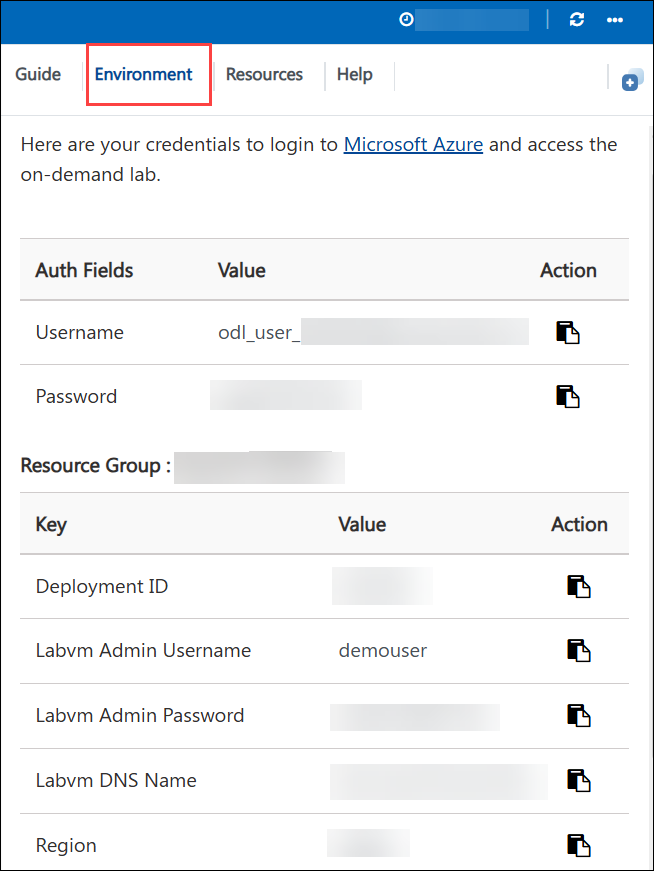
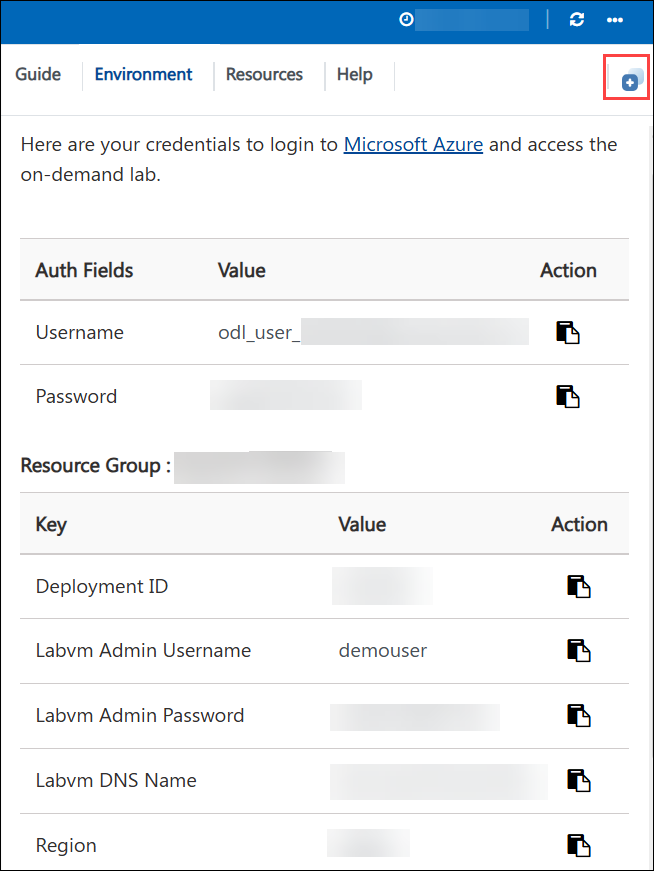
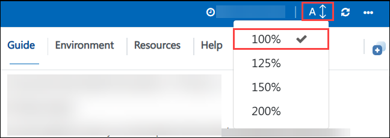
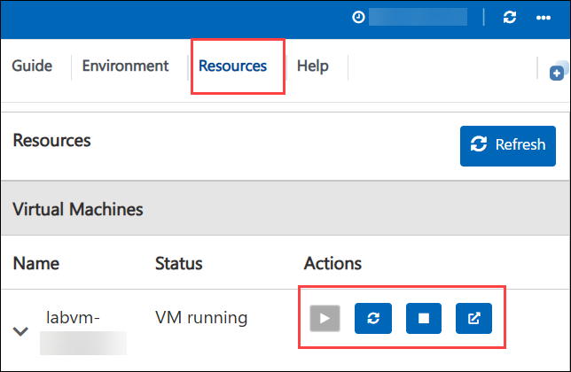
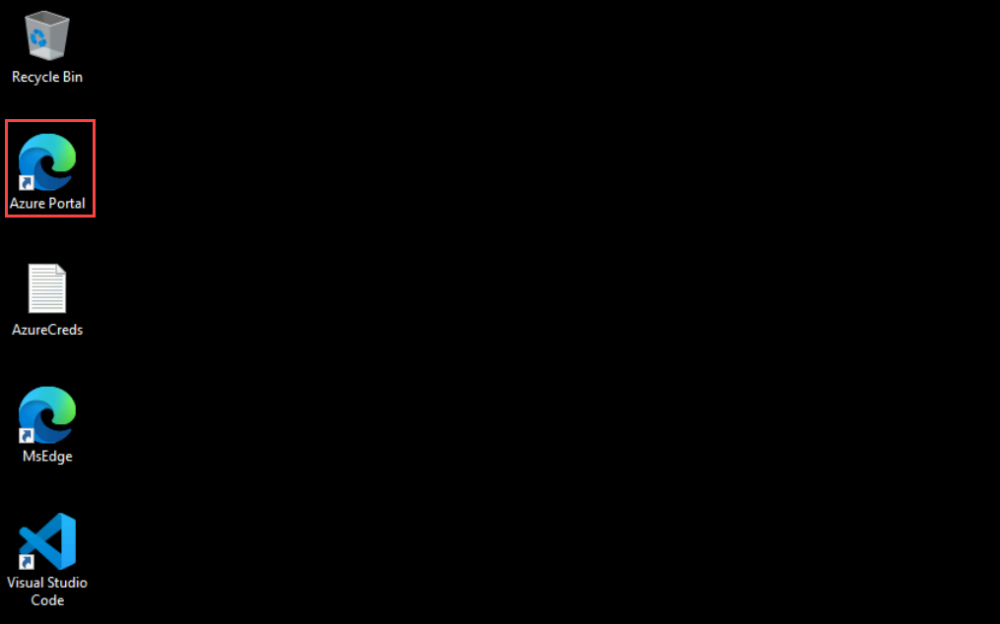
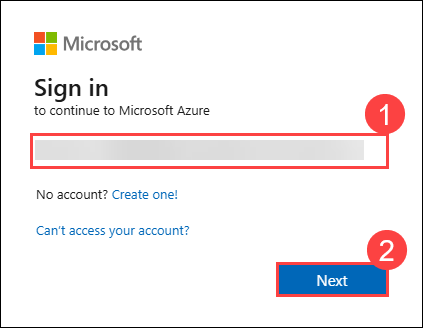
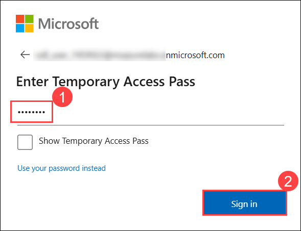

# Azure Synapse Analytics in a Day Lab

### Overall Estimated Duration: 8 Hours

## Overview

The Azure Synapse Analytics in a Day lab is a hands-on workshop that introduces participants to the capabilities of Azure Synapse Analytics, combining big data and data warehousing into a unified platform. Attendees will learn to ingest and prepare data from various sources, explore data warehousing concepts, and perform data analysis using SQL and Spark within Synapse Studio. The lab also covers integration with Power BI for interactive reporting and emphasizes security, monitoring, and best practices. Through guided exercises, participants will gain practical experience in leveraging Azure Synapse to drive data insights and enhance decision-making in an enterprise setting.

### Wide World Importers

Wide World Importers (WWI) is a wholesale novelty goods importer and distributor operating from the San Francisco Bay Area.

As a wholesaler, WWI's customers are mostly companies who resell to individuals. WWI sells to retail customers across the United States, including speciality stores, supermarkets, computing stores, tourist attraction shops, and some individuals. WWI sells to other wholesalers via a network of agents who promote the products on WWI's behalf. While all of WWI's customers are currently based in the United States, the company intends to expand into other countries.

WWI buys goods from suppliers, including novelty and toy manufacturers, and other novelty wholesalers. They stock the goods in their WWI warehouse and reorder from suppliers as needed to fulfil customer orders. They also purchase large volumes of packaging materials and sell these in smaller quantities as a convenience for the customers.

Recently WWI started to sell a variety of edible novelties such as chili chocolates. The company previously did not have to handle chilled items. To meet food handling requirements, they must monitor the temperature in their chiller room and any of their trucks that have chiller sections.

### Lab context

Wide World Importers is designing and implementing a Proof of Concept (PoC) for a unified data analytics platform. Their soft goal is to bring siloed teams to work together on a single platform.

In this guided-lab, you will play the role of various persons: a data engineer, a business analyst, and a data scientist. The workspace is already set up to focus on some of the core development capabilities of Azure Synapse Analytics.

By the end of this lab, you will have performed a non-exhaustive list of operations that combine the strength of Big Data and SQL analytics into a single platform.

## Objectives

The objective of the lab is to equip participants with the foundational skills and practical experience needed to leverage Azure Synapse Analytics for data integration, preparation, and analysis. By the end of the workshop, attendees will be proficient in ingesting and transforming data from diverse sources, utilizing SQL and Spark for data exploration, and integrating with Power BI for effective reporting. This hands-on experience aims to empower participants to implement data-driven solutions that enhance decision-making and drive business insights within their organizations.

- **Explore the data lake with Azure Synapse SQL On-demand and Azure Synapse Spark:** Enable users to efficiently query and analyze data stored in a data lake by utilizing Azure Synapse SQL On-demand for flexible querying and Azure Synapse Spark for advanced analytics, empowering teams to extract meaningful insights without the need for extensive data movement.
  
- **Build a Modern Data Warehouse with Azure Synapse Pipelines:** Facilitate the creation of an automated and scalable modern data warehouse by leveraging Azure Synapse Pipelines for seamless data ingestion, transformation, and orchestration, allowing organizations to integrate disparate data sources and deliver timely insights for decision-making.

- **High-Performance Analysis with Azure Synapse Dedicated SQL Pools:** Optimize data retrieval and analysis performance through the implementation of dedicated SQL pools, which provide robust computational resources for handling complex queries on large datasets, ensuring rapid query execution and improved analytical capabilities.
  
- **Lake Databases and Database Templates:** Provide a structured approach to organizing and managing data in lake databases using pre-defined templates, streamlining data operations and enhancing data accessibility for analytics while maintaining consistency across different data sets.
  
- **Log and telemetry analytics:** Enable real-time monitoring and analysis of logs and telemetry data, allowing organizations to derive actionable insights into system performance, user behavior, and operational metrics, thereby facilitating proactive troubleshooting and optimization.

- **Data governance with Azure Purview:** Implement comprehensive data governance practices using Azure Purview to ensure data compliance, discoverability, and management across the organization, thereby enhancing trust in data usage and facilitating regulatory adherence.
  
- **Power BI integration:** Enhance data visualization and reporting capabilities by seamlessly integrating Azure Synapse Analytics with Power BI, enabling users to create dynamic dashboards and interactive reports that provide real-time insights and support informed decision-making across the business.

## Pre-requisites

Participants should have:

- **Basic Understanding of Cloud Computing:** Familiarity with cloud concepts and the Azure ecosystem, including Azure services and infrastructure.
- **Familiarity with Data Concepts:** Understanding fundamental data concepts, such as databases, data lakes, data warehousing, and ETL (Extract, Transform, Load) processes.
- **SQL Knowledge:** Basic proficiency in SQL for querying and manipulating data, as many tasks will involve writing SQL queries.
- **Experience with Data Analytics:** Some exposure to data analytics principles and techniques to better grasp the analytical capabilities of Azure Synapse.
- **Introduction to Azure Synapse Analytics:** Basic knowledge of Azure Synapse Analytics features and components to facilitate understanding of the workshop content.
- **Familiarity with Data Visualization Tools:** Awareness of data visualization concepts and tools like Power BI will help participants leverage reporting capabilities effectively.
- **Basic Programming Skills (Optional):** Familiarity with programming languages such as Python or R can be beneficial for using Azure Synapse Spark, although not mandatory.

## Architecture

Various Azure services work together to create a cohesive analytics architecture. Key services include **Azure Synapse Analytics** for data integration, transformation, and analysis; **Azure Data Lake Storage** for scalable data storage; **Azure Synapse Pipelines** for orchestrating data workflows; **Azure Synapse SQL On-demand** and **Spark** for querying and analyzing large datasets; **Azure Dedicated SQL Pools** for high-performance data warehousing; and **Azure Purview** for data governance and cataloging. The architecture facilitates a seamless flow of data from diverse sources into the data lake, where it can be transformed and stored as lake databases. Participants will leverage these services to build an end-to-end data solution, enabling efficient data ingestion, real-time analytics, and insightful reporting through **Power BI** integration, all within a unified environment designed to drive data-driven decision-making in organizations.

## Architecture Diagram

## Explanation of Components

The architecture for this lab involves the following key components:

- **Azure Synapse Analytics:** A unified analytics service that integrates big data and data warehousing, providing a platform for data ingestion, processing, and analysis.
- **Azure Data Lake Storage:** A scalable and secure data storage solution designed for big data analytics, enabling the storage of large volumes of structured and unstructured data.
- **Azure Synapse SQL On-demand:** A serverless SQL query engine that allows users to run ad-hoc queries on data in Azure Data Lake without the need for provisioning resources.
- **Azure Synapse Spark:** A fast, in-memory analytics engine that enables big data processing and machine learning using Apache Spark within Azure Synapse.
- **Azure Synapse Pipelines:** A data integration service that orchestrates and automates data workflows, enabling seamless data ingestion and transformation from various sources.
- **Azure Dedicated SQL Pools:** High-performance data warehousing solutions that provide dedicated resources for executing complex queries and analyzing large datasets efficiently.
- **Lake Databases:** Structured databases within Azure Synapse that facilitate the organization and management of data in the data lake for easy access and analysis.
- **Azure Purview:** A data governance service that helps discover, classify, and manage data across the organization, ensuring compliance and enhancing data quality.
- **Power BI:** A business analytics tool that integrates with Azure Synapse to create interactive reports and dashboards, enabling data visualization and informed decision-making.

## Getting Started with the Lab
 
Welcome to your Azure Synapse Analytics in a Day Lab! We've prepared a seamless environment for you to explore and learn about Azure services. Let's begin by making the most of this experience:
 
## Accessing Your Lab Environment
 
Once you're ready to dive in, your virtual machine and lab guide will be right at your fingertips within your web browser.

  

## Virtual Machine & Lab Guide
 
Your virtual machine is your workhorse throughout the workshop. The lab guide is your roadmap to success.
 
## Exploring Your Lab Resources
 
To get a better understanding of your lab resources and credentials, navigate to the **Environment** tab.
 
  
 
## Utilizing the Split Window Feature
 
For convenience, you can open the lab guide in a separate window by selecting the **Split Window** button from the Top right corner.
 
  

## Lab Guide Zoom In/Zoom Out
 
To adjust the zoom level for the environment page, click the **A↕: 100%** icon located next to the timer in the lab environment.

 
 
## Managing Your Virtual Machine
 
Feel free to **Start**, **Restart**, or **Stop** your virtual machine as needed from the Resources tab. Your experience is in your hands!

  

## Let's Get Started with Azure Portal
 
1. On your **LabVM**, click on the **Azure Portal** icon as shown below:
 
    

1. On the **Sign in to Microsoft Azure** tab, you will see the login screen. Enter the following email/username, and click on **Next (2)**. 

   * **Email/Username:** <inject key="AzureAdUserEmail"></inject> **(1)**
     
      

1. Now enter the following password and click on **Sign in (2)**.
   
   * **Enter Temporary Access Pass:** <inject key="AzureAdUserPassword"></inject> **(1)**
   
      
     
1. If you see the pop-up **Stay Signed in?**, select **No**.

   

1. If a **Welcome to Microsoft Azure** pop-up window appears, simply click **Cancel** to skip the tour.

   

## Support Contact
 
The CloudLabs support team is available 24/7, 365 days a year, via email and live chat to ensure seamless assistance at any time. We offer dedicated support channels tailored specifically for both learners and instructors, ensuring that all your needs are promptly and efficiently addressed.

Learner Support Contacts:

- Email Support: cloudlabs-support@spektrasystems.com
- Live Chat Support: https://cloudlabs.ai/labs-support

Now, click on **Next >>** from the lower right corner to move on to the next page.

## Happy Learning!!

