# SQL Datawarehouse with Synapse

### Estimated Duration: 4 Hours

## Lab Scenario

Contoso is modernizing its analytics platform to centralize **sales, customer, and operational data** coming from multiple business systems and external APIs. The data engineering team uses **Microsoft Azure Synapse Analytics** to ingest raw data into **Azure Data Lake Storage Gen2**, transform it using **Synapse Notebooks and Data Flows**, and load curated datasets into a **dedicated SQL pool** for enterprise reporting. To ensure reliable daily operations, the team monitors **pipeline executions**, Spark application performance, and ETL task status through Synapse Studio and Azure Monitor. This lab simulates Contoso’s **end-to-end data warehouse workflow**, helping users understand how modern organizations build and manage scalable analytics solutions in real-world environments.

## Overview

In this lab, you will build and execute a **pipeline with parallel activities** to ingest data into **Azure Data Lake**, perform transformations, and load the results into an **Azure Synapse dedicated SQL pool**. You will also validate and monitor **pipeline execution and task status** throughout the workflow.

Reliable analytics requires systematic movement and processing of data. After exploring and profiling datasets, the next step is to route them to the appropriate processing and storage locations while performing essential data-wrangling tasks such as extraction, parsing, joins, normalization, augmentation, cleansing, consolidation, and filtering.

**Azure Synapse Analytics** delivers two complementary capabilities for these requirements: **Data Flows** for scalable, low-code transformations, and **Pipelines** for orchestration and execution. Together they support the full lifecycle of data integration **design, development, scheduling, execution, and monitoring**.

## Objectives

This lab provides practical, hands‑on experience building a modern data warehouse with Azure Synapse Analytics. You will ingest, transform, and load datasets using Synapse Notebooks, Data Flows, and Pipelines, and will learn to monitor pipeline execution and Spark application performance to validate results and optimize workloads.

- **Explore and modify a notebook**: Use Synapse Notebooks to process and transform data.
- **Explore, modify, and run a Pipeline containing a Data Flow**: Perform ETL operations using Data Flows.
- **Monitor pipelines**: Track execution status, analyze logs, and troubleshoot errors.
- **Monitor Spark applications**: Identify performance metrics and optimize Spark workloads.
  
## Prerequisites

Participants should have the following prerequisites:

- **An active Microsoft Azure subscription** to deploy and manage Azure resources.
- **An Azure Entra ID user account** with sufficient permissions to create and manage resources within the Azure subscription.
- **Basic familiarity with Azure services**: Understanding of Azure Synapse Analytics, Data Lake Storage, and Azure Monitor.
- **Fundamental knowledge of data processing**: Awareness of ETL (Extract, Transform, Load) concepts and structured data handling.
- **No prior experience with Synapse Pipelines required**: This lab introduces low-code and code-based approaches for data processing.
- **Access to an Azure Synapse Analytics workspace**: Ensure you have the necessary permissions to work with Pipelines, Notebooks, and Spark Pools.

## Architecture

This lab follows a modern data warehouse architecture using Azure Synapse Analytics to ingest, process, and store data efficiently. Data is ingested from multiple sources, including Azure Data Lake Storage Gen2, Azure SQL Database, and external APIs. Synapse Pipelines handle ETL (Extract, Transform, Load) processes, while Synapse Notebooks enable data transformation and machine learning operations using Apache Spark. Data Flows provide a low-code approach for scalable data transformations within Synapse Pipelines. Monitoring tools like Azure Monitor, Log Analytics, and Synapse Studio help track pipeline execution, analyze Spark performance, and troubleshoot errors to ensure efficient data processing.

## Architecture Diagram

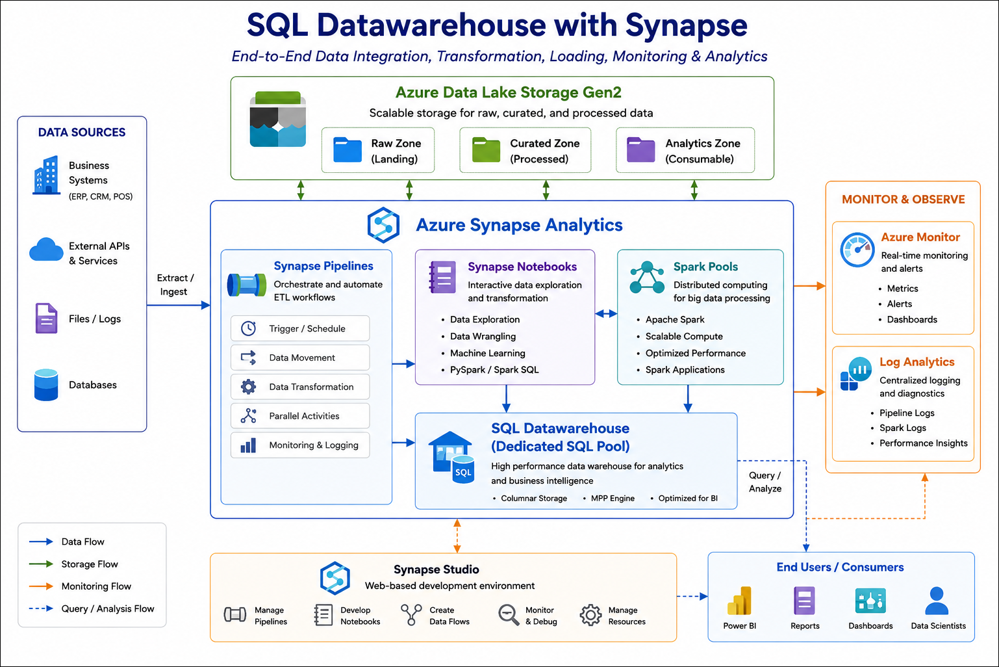

## Explanation of Components

The architecture for this lab involves several key components:

- **Azure Synapse Analytics** : A unified analytics platform that enables large-scale data integration, transformation, and analysis using SQL pools, Spark pools, and Synapse Pipelines.
- **Azure Data Lake Storage Gen2** : A scalable storage solution designed for big data analytics, used to store raw and processed data before loading it into Synapse.
- **Synapse Pipelines** : A data integration tool that automates ETL (Extract, Transform, Load) operations, enabling seamless data movement between sources and destinations.
- **Synapse Notebooks** : Interactive notebooks powered by Apache Spark, used for data exploration, transformation, and machine learning tasks.
- **Spark Pools** : A distributed computing environment within Synapse Analytics, used for executing Spark-based workloads efficiently.
- **Azure Monitor & Log Analytics** : Tools that provide real-time monitoring, diagnostics, and performance tracking for Synapse Pipelines and Spark applications.
- **Synapse Studio** : A web-based development environment for managing and orchestrating Synapse resources, including Pipelines, Notebooks, and Data Flows.
  
## Getting Started with Lab

Welcome to your SQL Datawarehouse with Synapse! We've prepared an interactive environment for you to explore Synapse Pipelines, Notebooks, Data Flows, and Spark monitoring. 

## Accessing Your Lab Environment
 
Once you're ready to dive in, your virtual machine and **Guide** will be right at your fingertips within your web browser.

   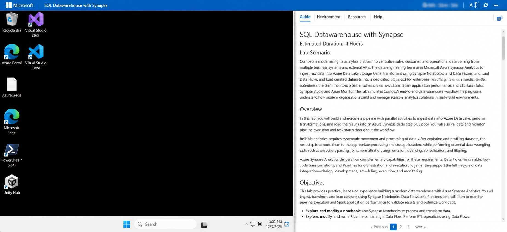 

   >**Note:** After launching the lab if you see a **Send diagnostic data to Microsoft** window, click on **Accept** to continue. 
   > 
   >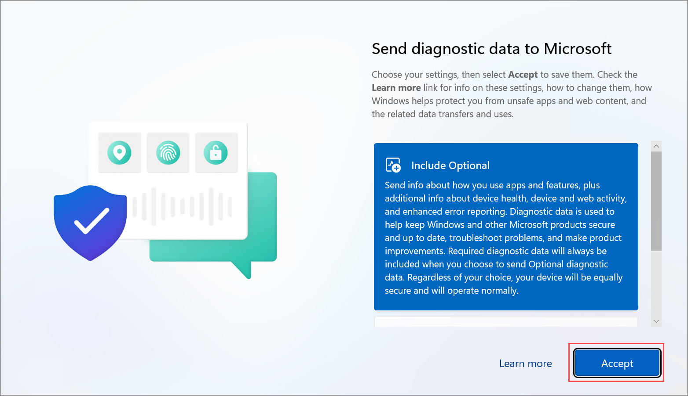 

## Virtual Machine & Lab Guide

In the integrated environment, the lab VM serves as the designated workspace, while the lab guide is accessible on the right side of the screen.

**Note:** Kindly ensure that you are following the instructions carefully to ensure the lab runs smoothly and provides an optimal user experience.
 
## Exploring Your Lab Resources
 
To get a better understanding of your lab resources and credentials, navigate to the **Environment** tab.

   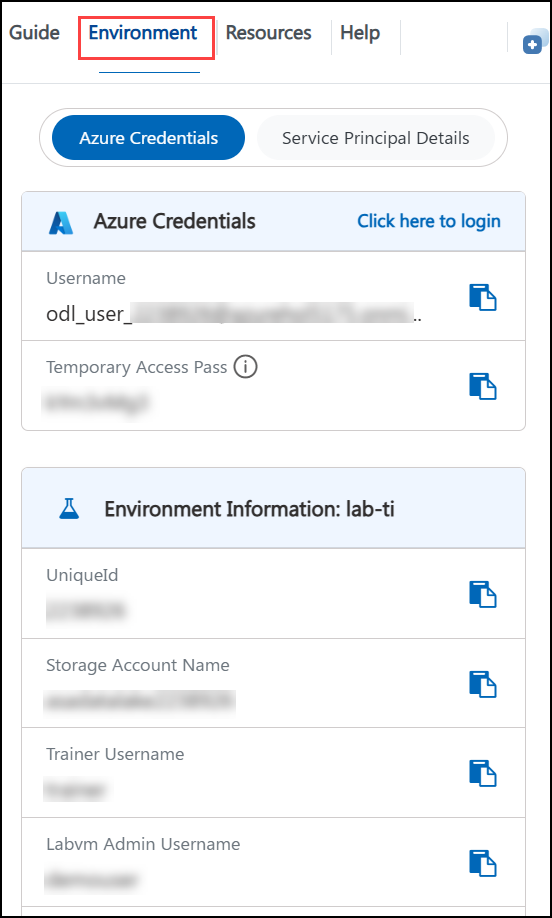
 
## Utilizing the Split Window Feature
 
For convenience, you can open the lab guide in a separate window by selecting the **Split Window** button from the Top right corner.
 
   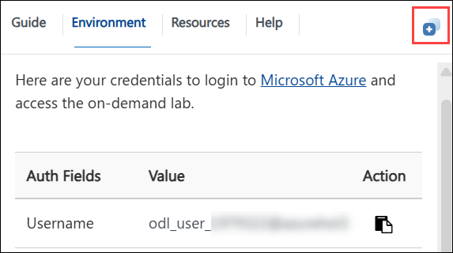
 
## Managing Your Virtual Machine
 
Feel free to **Start, Stop, or Restart (2)** your virtual machine as needed from the **Resources (1)** tab. Your experience is in your hands!
 
   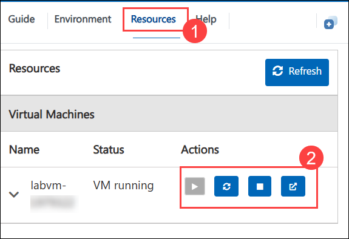

## Lab Guide Zoom In/Zoom Out
 
To adjust the zoom level for the environment page, click the **A↕** icon located next to the timer in the lab environment.

   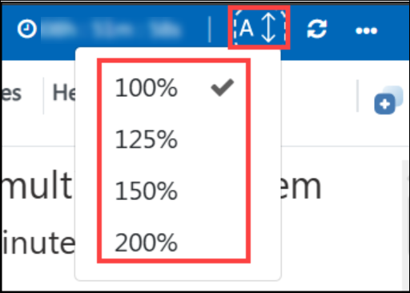

## Resize the Virtual Machine View

Use the **slider (three vertical dots)** located between the **Virtual Machine** and the **Lab Guide** panes to adjust the display size, allowing you to customize the layout based on your preference.

   

## Let's Get Started with Azure Portal
 
1. On your virtual machine, click on the **Azure Portal** icon as shown below:
 
   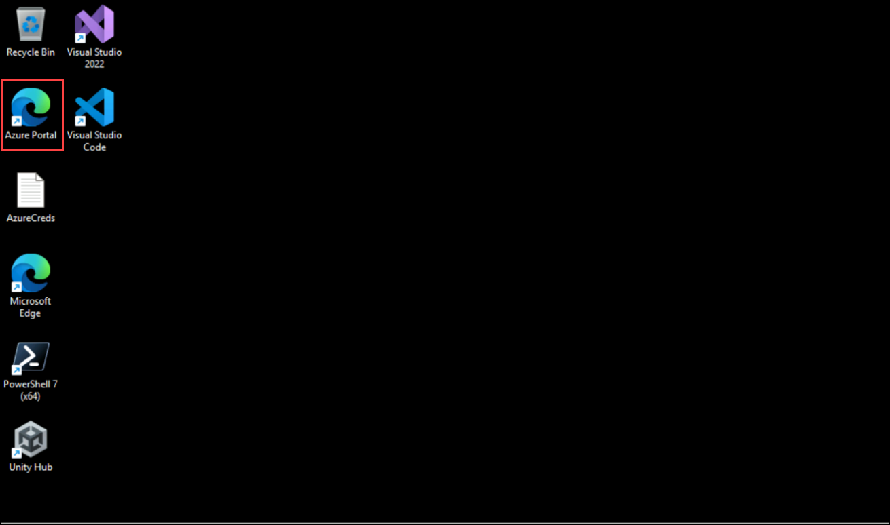

   >**Note:** If you encounter a pop up for Extension added in Microsoft Edge browser, please click on either of the options to continue. 
   >
   >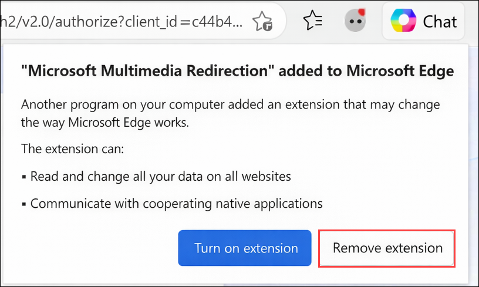

1. On the **Sign in to Microsoft Azure** tab you will see the login screen, in that enter the following email/username, and click on **Next**. 

   * **Email/Username**: <inject key="AzureAdUserEmail"></inject>
   
     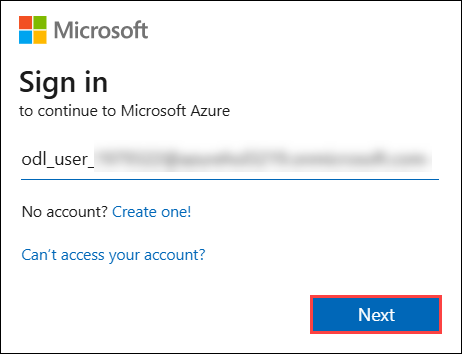
     
1. Now enter the following password and click on **Sign in**.
   
   * **Temporary Access Pass**: <inject key="AzureAdUserPassword"></inject>
   
     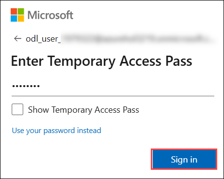

1. If you see the pop-up **Stay Signed in?**, click **Yes**.

1. If a **Welcome to Microsoft Azure** pop-up window appears, simply click **"Cancel"** to skip the tour.

## Support Contact
 
The CloudLabs support team is available 24/7, 365 days a year, via email and live chat to ensure seamless assistance at any time. We offer dedicated support channels tailored specifically for both learners and instructors, ensuring that all your needs are promptly and efficiently addressed.

Learner Support Contacts:
- Email Support: cloudlabs-support@spektrasystems.com
- Live Chat Support: https://cloudlabs.ai/labs-support

Now, click on **Next** from the lower right corner to move on to the next page.

### Happy Learning!!
