# Exercise 1: Data Exploration & Pipeline Development

### Estimated Duration: 2 Hours

## Overview

In this exercise, you explore and modify a Synapse notebook to understand how data is loaded, transformed, and analyzed. You then work with a Synapse Pipeline that includes a Data Flow, modify its activities, and execute it to validate the end-to-end data transformation process.

## Objectives

In this exercise, you will perform the following tasks:

  - Task 1 - Explore and modify a notebook
  - Task 2 - Explore, modify, and run a Pipeline containing a Data Flow

## Task 1 - Explore and modify a notebook

In this task, you see how easy it is to write into a SQL Pool table with Spark thanks to the SQL Analytics Connector. Notebooks are used to write the code required to write to SQL Pool tables using Spark.

1. In the Azure Portal, select **Resource groups**.

   

2. Select the **Synapse-AIAD** resource group.

   

3. Select **SQLPool01 (1)** and **Resume (2)** it before starting the exercise. Select **Yes** on the pop-up.

   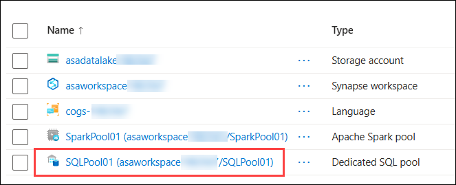

   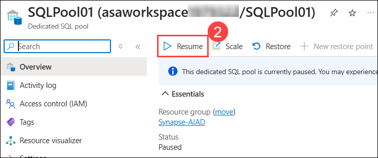

   >**Note :** You can ignore if it is already in running state.

5. In Azure portal search for **Azure Synapse Analytics (1)** and select **Azure Synapse Analytics (2)** from the list.

   

6. Navigate to **asaworkspace<inject key="Deployment ID" enableCopy="false"/>** by selecting it.

   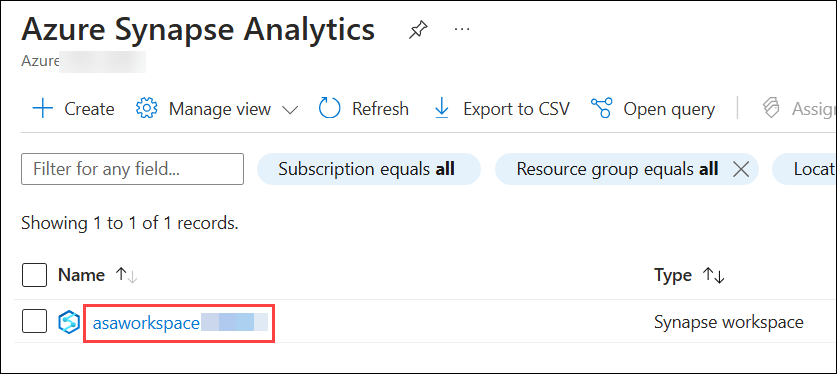

7. On the **Overview (1)** page click on **Open (2)** under getting started for Open Syanpse Studio.  

   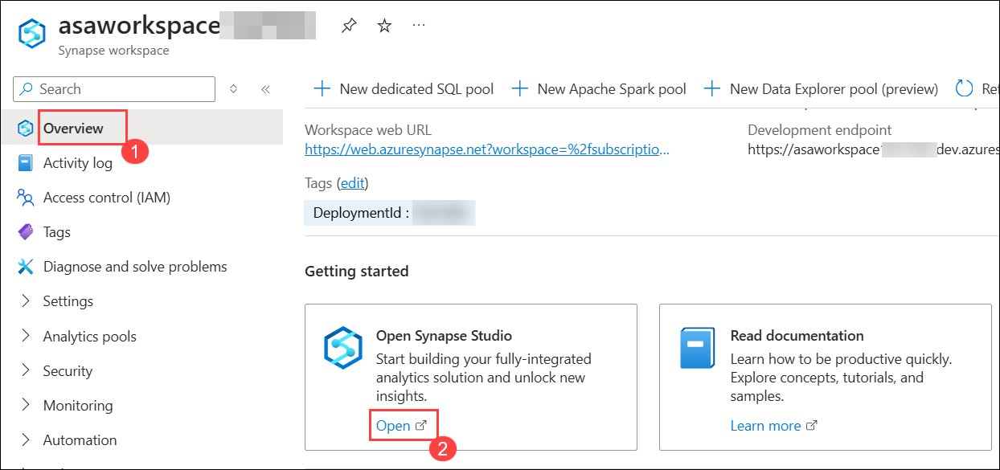

8. In Synapse Studio, select **Develop** from the left-hand menu.

   

9. Select **+ (1)**, then click on **Notebook (2)** to add a new notebook.

   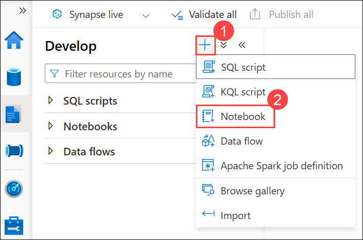

10. If not already attached, attach your Spark Compute **SparkPool01 (1)** by selecting it from the **Attach to** drop-down list and attach **PySpark(Python) (2)** by selecting it from **Language** drop down list.

    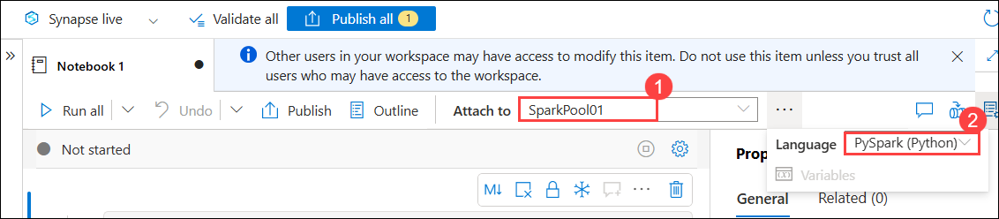

11. Paste the following into the new cell and **replace** `YOUR_DATALAKE_NAME` with your storage account name **<inject key="Storage Account Name"></inject> (1)**.

    ```scala
    %%spark

    // Set the path to read the WWI Sales files
    import org.apache.spark.sql.SparkSession

    // Set the path to the ADLS Gen2 account
    val adlsPath = "abfss://wwi@YOUR_DATALAKE_NAME.dfs.core.windows.net"
    ```

12. Select the **Run cell (2)** button to execute the new cell:

    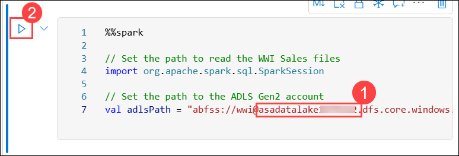

    > This cell imports required libraries and sets the `adlsPath` variable, which defines the path used to connect to an Azure Data Lake Storage (ADLS) Gen2 account. Connecting to ADLS Gen2 from a notebook in Azure Synapse Analytics uses the power of Azure Active Directory (AAD) pass-through between compute and storage. The `%%spark` "magic" sets the cell language to Scala, which is required to use the `SparkSession` library.

13. Hover over the area just below the cell output in the notebook, then select **+ Code** to add a new cell.

    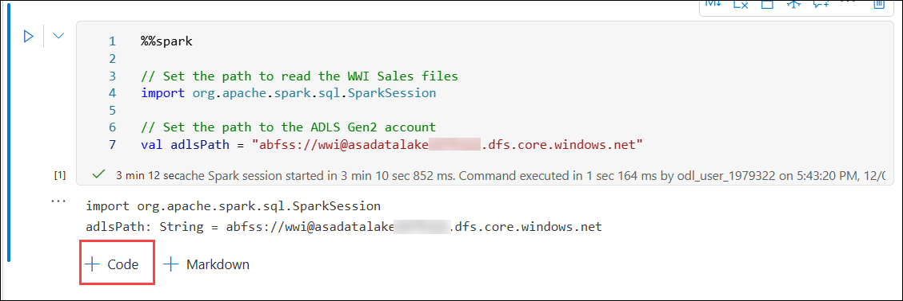

14. Paste the following and run the new cell:

    ```scala
    %%spark

    // Read the sales into a dataframe
    val sales = spark.read.format("csv").option("header", "true").option("inferSchema", "true").option("sep", "|").load(s"$adlsPath/factsale-csv/2012/Q4")
    sales.show(5)
    sales.printSchema()
    ```

    This code loads data from CSV files in the data lake into a DataSet. Note the `option` parameters in the `read` command. These options specify the settings to use when reading the CSV files. The options tell Spark that the first row of each file containers the column headers, the separator in the files in the `|` character, and that we want Spark to infer the schema of the files based on an analysis of the contents of each column. Finally, we display the first five records of the data retrieved and print the inferred schema to the screen.

15. When the cell finishes running, take a moment to review the associated output.

    > The output of this cell provides some insight into the structure of the data and the data types that have been inferred. The `show(5)` command results in the first five rows of the data read being output, allowing you to see the columns and a sample of data contained within each. The `printSchema()` command outputs a list of columns and their inferred types.

    

16. Hover over the area just below the cell output in the notebook, then select **+ Code** to add a new cell.

    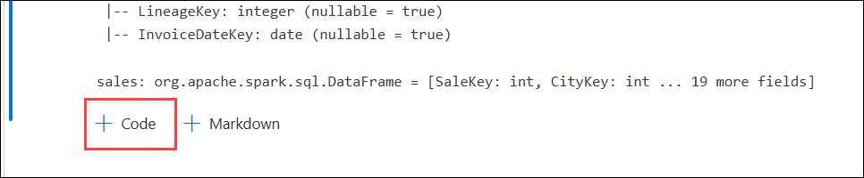

17. Paste the following and run the new cell:

    ```scala
    %%spark

    // Import libraries for the SQL Analytics connector
    import com.microsoft.spark.sqlanalytics.utils.Constants
    import org.apache.spark.sql.SqlAnalyticsConnector._
    import org.apache.spark.sql.SaveMode

    // Set target table name
    var tableName = s"SQLPool01.wwi_staging.Sale"

    // Write the retrieved sales data into a staging table in Azure Synapse Analytics.
    sales.limit(10000).write.mode(SaveMode.Append).sqlanalytics(tableName, Constants.INTERNAL)
    ```
    
    This code writes the data retrieved from Blob Storage into a staging table in Azure Synapse Analytics using the SQL Analytics connector. Using the connector simplifies connecting to Azure Synapse Analytics because it uses AAD pass-through. There is no need to create a password, identity, external table, or format sources, as it is all managed by the connector.

18. As the cell runs, select the arrow icon below the cell to expand the details for the Spark job. After approximately 1-2 minutes, the execution of Cell 3 will complete. Once it completes move on the next step.

    > This pane allows you to monitor the underlying Spark jobs, and observe the status of each. As you can see, the cell is split into two Spark jobs, and the progress of each can be observed. We will take a more in-depth look at monitoring Spark applications in Task 4 below.

    

    > **Note** : Ensure that the status of SQLpool01 is in **Online** state.

    

19. Close the notebook by selecting the **X (1)** from top then select **Keep session (2)** on Keep current session? pane and  select **Close + discard changes (3)**. Closing the notebook will ensure you free up the allocated resources on the Spark Pool.
     
    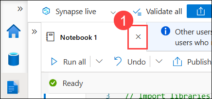

    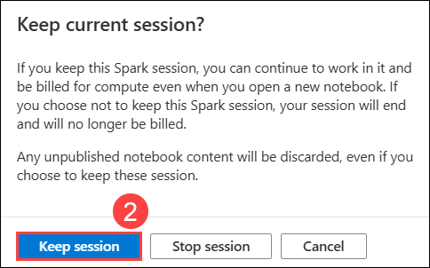

    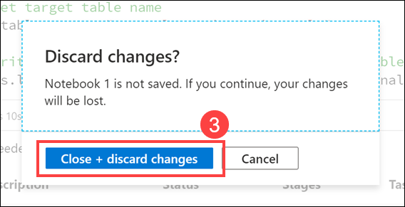

20. Now, select **Data** from the left-hand menu.

    

21. Under **Workspace (1)** tab expand **SQL databases (2)** and then expand the **SQLPool01 (3)** database.

    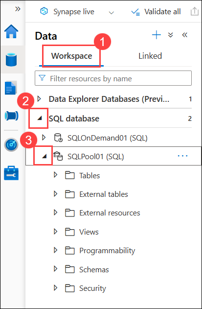

22. Expand **Tables** and locate the table named `wwi_staging.Sale`.

    > **Note**: If you do not see the table, select the Actions ellipsis next to Tables and then select **Refresh** from the fly-out menu.

    

23. To the right of the `wwi_staging.Sale` table, select the Actions ellipsis.

    

24. In the Actions menu, select **New SQL script (1) > Select TOP 100 rows (2)**.

    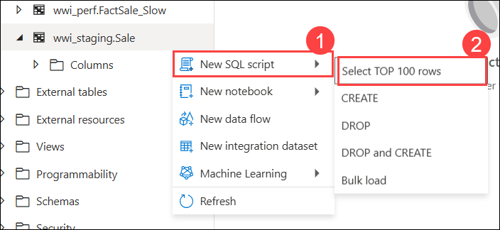

25. Select **Run (1)** to execute the query. Observe the **Results (2)** in the output pane, and notice how easy it was to use Spark notebooks to write data from Blob Storage into Azure Synapse Analytics in Steps 9 and 10.

    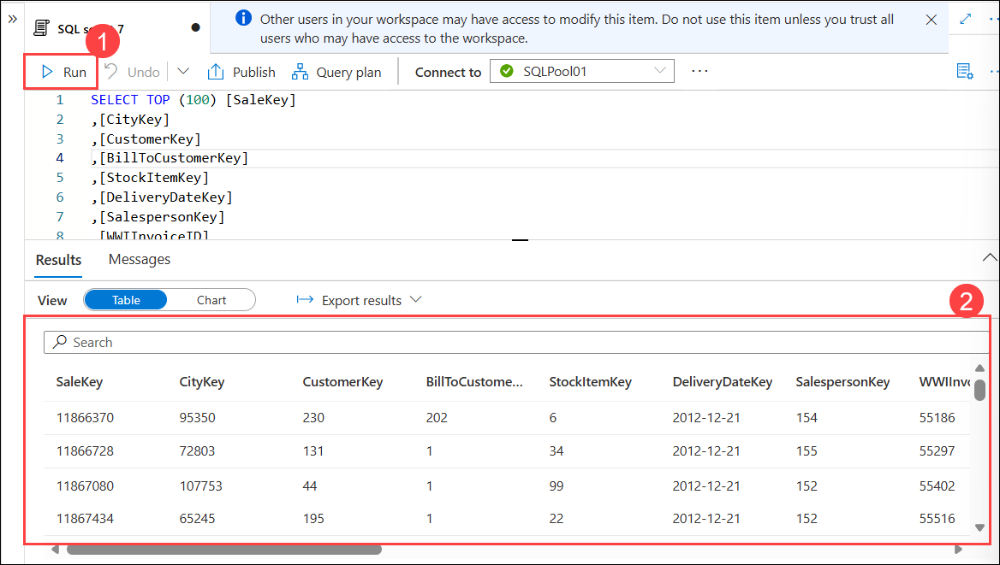

26. Close the SQL script generated by `wwi_staging.Sale`.

> **Congratulations** on completing the task! Now, it's time to validate it. Here are the steps:
      
   - If you receive a success message, you can proceed to the next task.
   - If not, carefully read the error message and retry the step, following the instructions in the lab guide.
   - If you need any assistance, please contact us at cloudlabs-support@spektrasystems.com. We are available 24/7 to help you out.

<validation step="0ed2a2e6-1b08-4524-a785-7ec3111f94c9" />

## Task 2 - Explore, modify, and run a Pipeline containing a Data Flow

In this task, you use a Pipeline that implements Code-free AI to do sentiment analysis on customer feedback and contains a Data Flow to explore, transform, and load data into an Azure Synapse Analytics table. Using Cognitive Services and data flows in Pipelines allows you to handle code-free AI workloads, perform data ingestion and transformations, similar to what you did in Task 1, but without writing any code

1. In Synapse Studio and select **Integrate** from the left-hand menu.

   

2. In the Integrate menu, expand **Pipelines**, then select **Exercise 2 - Enrich Data**.

   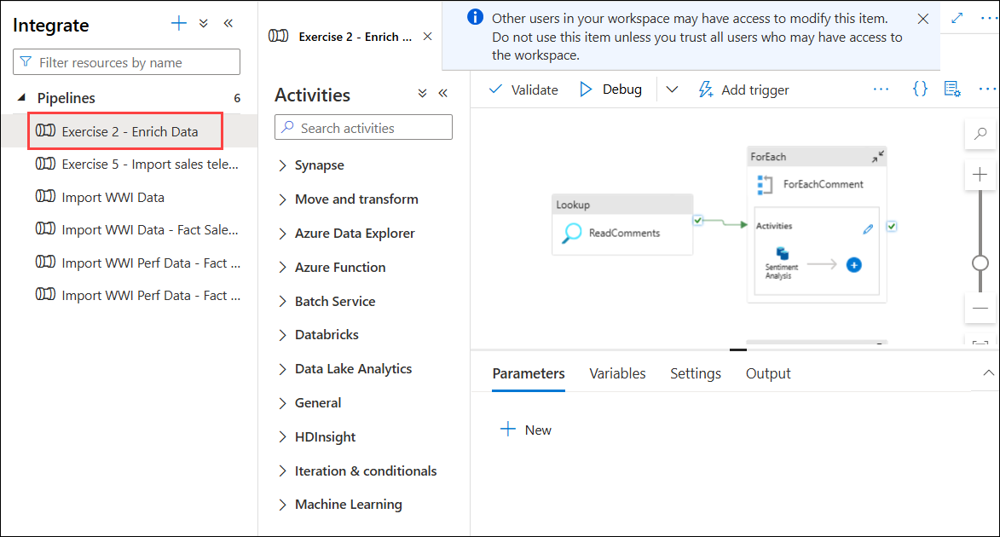

   > Selecting a pipeline opens the pipeline canvas, where you can review and edit the pipeline using a code-free, graphical interface. This view shows the various activities within the pipeline and the links and relationships between those activities. The `Exercise 2 - Enrich Data` pipeline contains four activities;

   > - a Lookup activity named `ReadComments` reading customer comments
   > - a ForEach loop named `ForEachComment` iterating through comments and running Sentiment Analysis with Azure Cognitive Services
   > - a copy data activity named `Import Customer dimension`
   > - a mapping data flow activity named `Enrich Customer Data`.

3. Now, take a closer look at each of the activities within the pipeline. On the canvas graph, select the **Lookup (1)** activity named `ReadComments` and switch to the **Settings (2)** tab. The source dataset is set to a CSV files **(3)** stored in the data lake.

   > A lookup activity reads and returns the content of a file which can be consumed in a subsequent copy, transformation, or control flow activities like ForEach activity. The Lookup activity output supports up to 4 MB in size. In this case, the source is set to a single CSV file that is much smaller. For larger data sets multiple source files can be used.

   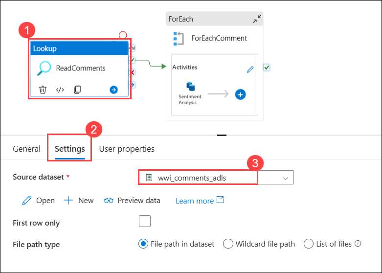
   
4. From the canvas graph, select the **ForEach (1)** activity named `ForEachComment` and switch to the **Settings (2)** tab. The **Items** property is set to receive the output of the previous `ReadComments` **(3)** activity. You might have noticed the green connection line between the two activities that define a dependency between the two activities. The line makes sure comments are read before the ForEach loop can iterate it. Select the edit button **(4)** in the ForEach activity's Activities box to navigate into the loop.

   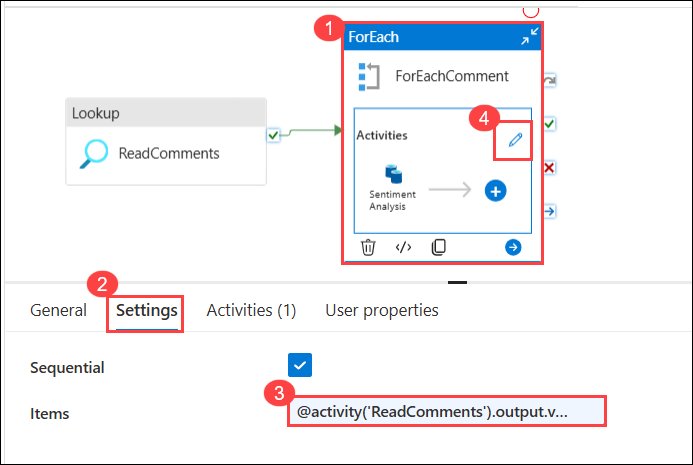

5. Select **Copy data** activity named `Sentiment Analysis` **(1)** and switch to the **Source (2)** tab. The Copy Data activity's Source dataset is set to a REST resource **(3)** backed by Azure Cognitive Services. A POST **(4)** HTTP request will be made to the Azure Cognitive Services endpoint carrying a request body **(5)** that includes the text from the current iteration that will be analyzed for sentiments.

   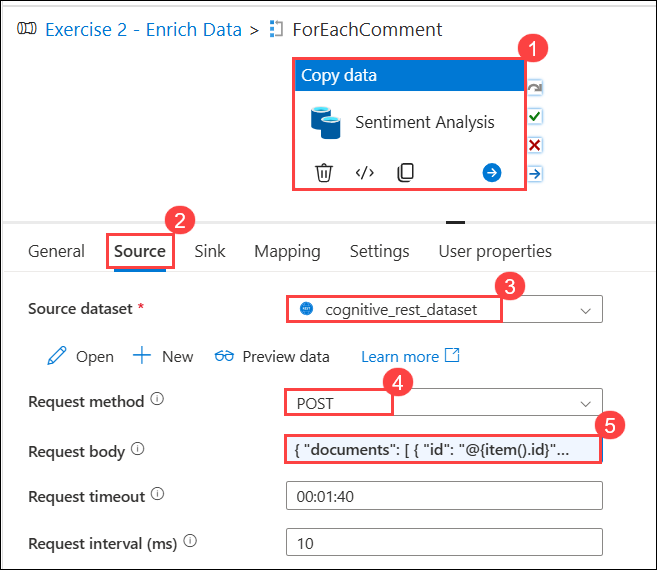

6. Switch to the **Sink (1)** tab. Here, the sink dataset is set to a JSON file location in the data lake. Once the Copy data activity gets the result of the sentiment analysis from the remote REST resource endpoint, the result will be saved as separate JSON files into the Sink dataset **(2)**. The files will include a complete sentiment analysis for the customer comment that can be queried and analyzed further. Select **Exercise 2 - Enrich Data (3)** link to go back to the main pipeline canvas.

   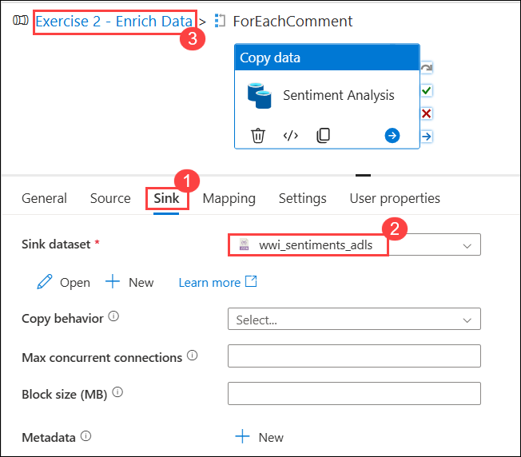

7. On the canvas graph, select the **Copy data (1)** activity named `Import Customer dimension`.

   > Below the graph is a series of tabs, each providing additional details about the selected activity. The **General** tab displays the name and description assigned to the activity and a few other properties.

8. Select the **Source (2)** tab. The source defines the location from which data will be copied by the activity. The **Source dataset** field is a pointer to the location of the source data.

   > Take a moment to review the various properties available on the Source tab. Data is being retrieved from files stored in a data lake.

   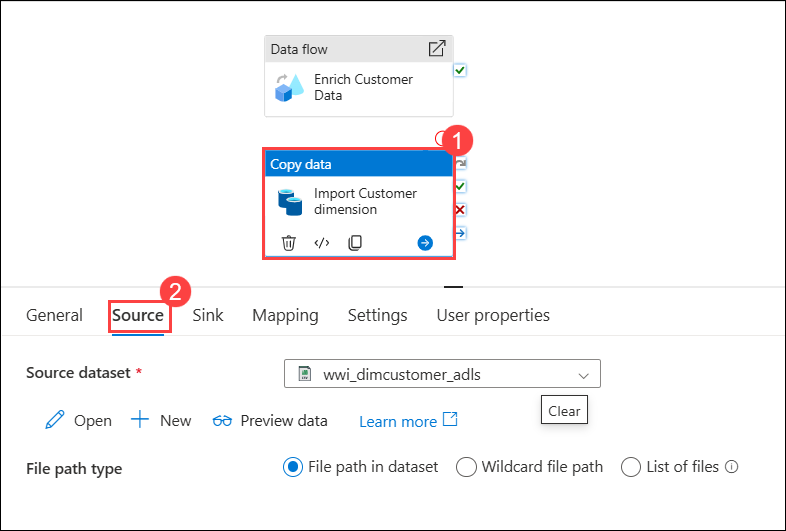

9. Next, select the **Sink (1)** tab. The sink specifies where the copied data will be written. Like the Source, the sink uses a dataset to define a pointer to the target data store. Select **PolyBase (2)** for the `Copy method`. This improves the data loading speed as compared to the default setting of bulk insert.

   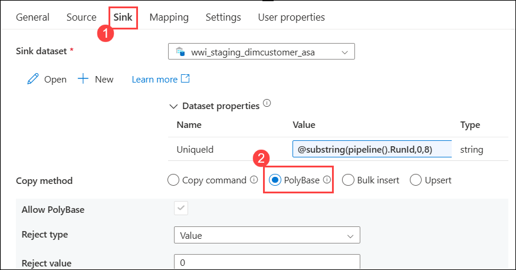

   > Reviewing the fields on this tab, you will notice that it is possible to define the copy method, table options, and to provide pre-copy scripts to execute. Also, take special note of the sink dataset, `wwi_staging_dimcustomer_asa`. The dataset requires a parameter named `UniqueId`, which is populated using a substring of the Pipeline Run Id. This dataset points to the `wwi_staging.DimCustomer_UniqueId` table in Synapse Analytics, which is one of the data sources for the Data Flow. We will need to ensure that the copy activity successfully populates this table before running the data flow.

10. Select the **Mapping** tab. On this tab, you can review and set the column mappings. As you can see on this tab, the spaces are being removed from the column names in the sink.

    

11. Finally, select the **Settings (1)** tab. Check **Enable staging (2)** and expand **Staging settings (3)**. Search and select **asadatalake01 (4)** under `Staging account linked service`, then type **staging (5)** into `Storage Path`. Finally, check **Enable Compression (6)**.

    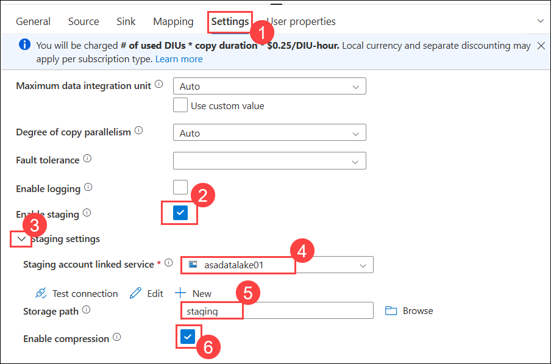

    > Since we are using PolyBase with dynamic file properties, owing to the UniqueId values, we need to [enable staging](https://docs.microsoft.com/azure/data-factory/connector-azure-sql-data-warehouse#staged-copy-by-using-polybase). In cases of large file movement activities, configuring a staging path for the copy activity can improve performance.

12. Switch to the **Data Flow (1)** activity by selecting the `Enrich Customer Data` Data Flow activity on the pipeline design canvas, then select the **Settings (2)** tab.

    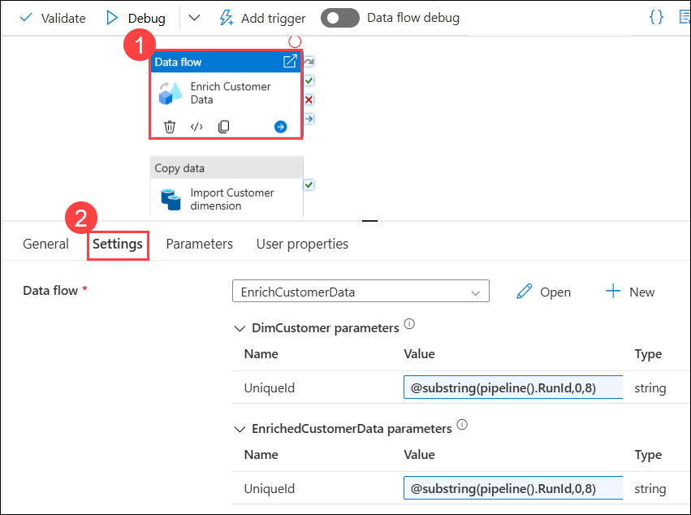

    > Observe the settings configurable on this tab. They include parameters to pass into the data flow, the Integration Runtime, and compute resource type and size to use. If you wish to use staging, you can also specify that here.

13. Next, select the **Parameters** tab in the configuration panel of the Data Flow activity.

    

    Notice that the value contains:

    ```sql
    @substring(pipeline().RunId,0,8)
    ```

    > This sets the UniqueId parameter required by the `EnrichCustomerData` data flow to a unique substring extracted from the pipeline run ID.

    > **NOTE :** If the **Parameters** value is absent, please update the value with **```@substring(pipeline().RunId,0,8)```** by selecting **Pipeline expression** and paste the value under **Add dynamic content** then **finish**.

14. Take a minute to look at the options available on the various tabs in the configuration panel. You will notice the properties here define how the data flow operates within the pipeline.

15. Now, let us take a look at the definition of the data flow the Data Flow activity references. **Double-click** the `Enrich Customer Data` Data Flow activity on the pipeline canvas to open the underlying Data Flow in a new tab.

    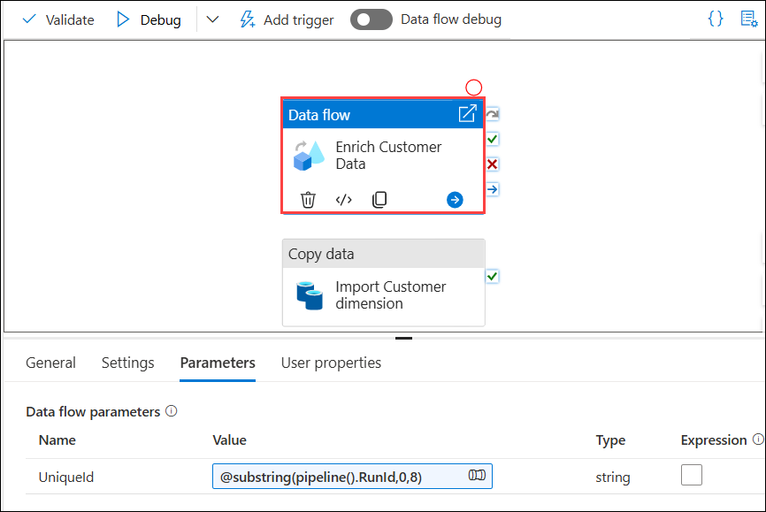

    > **Important**: Typically, when working with Data Flows, you would want to enable **Data flow debug**. [Debug mode](https://docs.microsoft.com/azure/data-factory/concepts-data-flow-debug-mode) creates a Spark cluster to use for interactively testing each step of the data flow and allows you to validate the output prior to saving and running the data flow. Enabling a debugging session can take up to 10 minutes, so you will not enable this for the purposes of this workshop. Screenshots will be used to provide details that would otherwise require a debug session to view.

    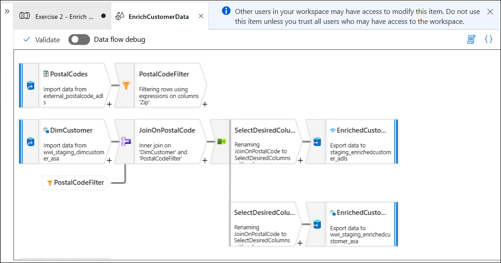

16. The [Data Flow canvas](https://docs.microsoft.com/azure/data-factory/concepts-data-flow-overview#data-flow-canvas) allows you to see the construction of the data flow, and each component contained within it in greater detail.

    > From a high level, the `EnrichCustomerData` data flow is composed of two data sources, multiple transformations, and two sinks. The data source components, `PostalCodes` and `DimCustomer`, ingest data into the data flow. The `EnrichedCustomerData` and `EnrichedCustomerDataAdls` components on the right are sinks, used to write data to data stores. The remaining components between the sources and sinks are transformation steps, which can perform filtering, joins, select, and other transformational actions on the ingested data.

    

17. To better understand how a data flow functions, let us inspect the various components. Select the **PostalCodes (1)** data source on the data flow canvas.

    > On the **Source settings** tab, we see properties similar to what we saw on the pipeline activities property tabs. The name of the component can be defined, along with the source dataset and a few other properties. The `PostalCodes` dataset points to a CSV file **(2)** stored in an Azure Data Lake Storage Gen2 account.

    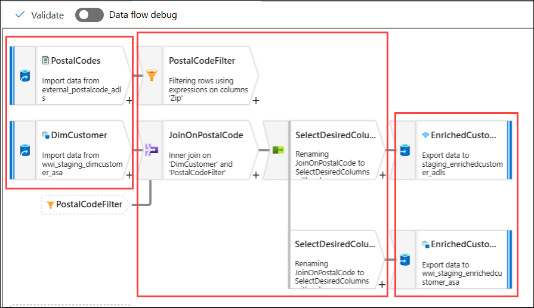

18. Select the **Projection** tab.

    > The **Projections (1)** tab allows you to define the schema of the data being ingested from a data source. A schema is required for each data source in a data flow to allow downstream transformations to perform actions against the fields in the data source. Note that selecting **Import schema** requires an active debug session to retrieve the schema data from the underlying data source, as it uses the Spark cluster to read the schema. In the screenshot below, notice the `Zip` **(2)** column is highlighted. The schema inferred by the import process set the column type to `integer`. For US zip code data, the data type was changed to `string` so leading zeros are not discarded from the five-digit zip codes. It is important to review the schema to ensure the correct types are set, both for working with the data and to ensure it is displayed and stored correctly in the data sink.

    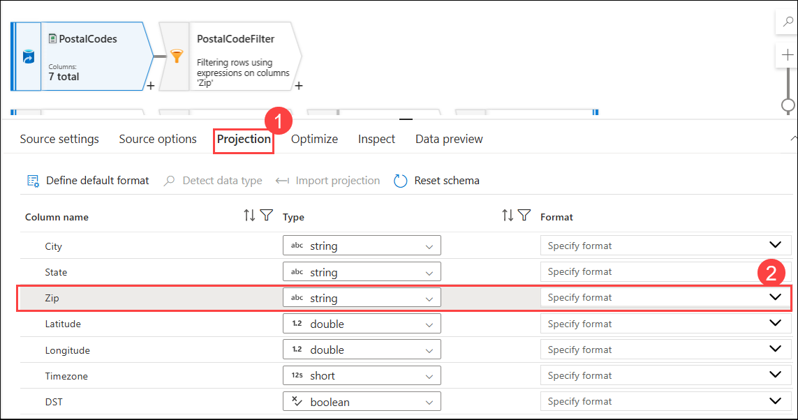

19. The **Data preview** tab allows you to ingest a small subset of data and view it on the canvas. This functionality requires an active debug session, so for this workshop, a screenshot that displays the execution results for that tab is provided below.

    > **NOTE :** This step cannot be performed in the lab environment.

    > The `Zip` column is highlighted on the Data preview tab to show a sample of the values contained within that field. Below, you will filter the list of zip codes down to those that appear in the customer dataset.

    

20. Before looking at the `PostalCodeFilter`, quickly select the `+` button to the right of the `PostalCodes` data source to display a list of available transformations.

    > Take a moment to browse the list of transformations available in Data Flows. From this list, you get an idea of the types of transformations that are possible using data flows. Transformations are broken down into three categories, **multiple inputs/outputs**, **schema modifiers**, and **row modifiers**. You can learn about each transformation in the docs by reading the [Data flow transformation overview](https://docs.microsoft.com/azure/data-factory/data-flow-transformation-overview) article.

    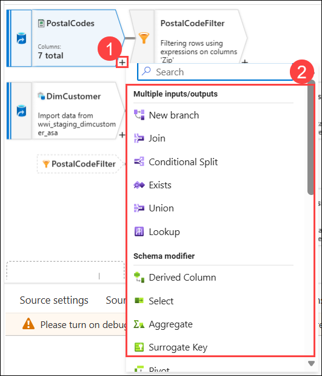

21. Next, select the `PostalCodeFilter` transformation in the graph on the data flow canvas.

    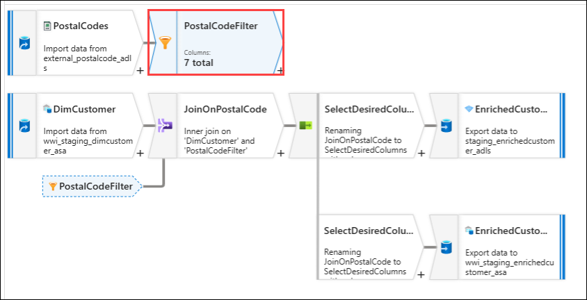

22. In the **Filter settings (1)** tab of the configuration panel, click anywhere inside the **Filter on (2)** box then click on **Open expression builder (3)**.

    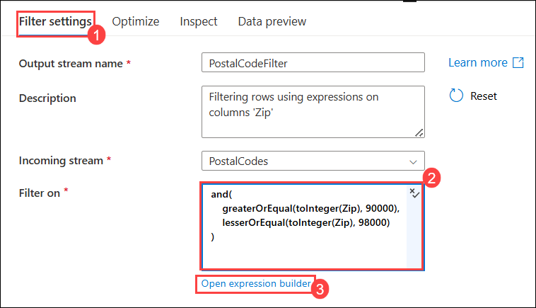

23. This will open the Dataflow expression builder.

    > In data flows, many transformation properties are entered as expressions. These expressions are composed of column values, parameters, functions, operators, and literals that evaluate to a Spark data type at run time. To learn more, visit the [Build expressions in data flow](https://docs.microsoft.com/azure/data-factory/concepts-data-flow-expression-builder) page in the documentation.

    

24. The filter currently applied ensures all zip codes are between 90000 and 98000. Observe the different expression elements and values in the area below the expression box that help you create and modify filters and other expressions.

25. Select **Cancel** to close the visual expression builder.

26. Select the **DimCustomer (1)** data source on the data flow canvas graph.

    > Take a few minutes to review the various tabs in the configuration panel for this data source to get a better understanding of how it is configured, as you did above. Note that this data source relies on the `wwi_staging.DimCustomer_UniqueId` table from Azure Synapse Analytics for its data. `UniqueId` is supplied by a parameter to the data flow, which contains a substring of the Pipeline Run Id. Before running the pipeline, you will add a dependency to the Data Flow activity to ensure the Copy activity has populated the `wwi_staging.DimCustomer_UniqueId` in Azure Synapse Analytics before allowing the data flow to execute.

    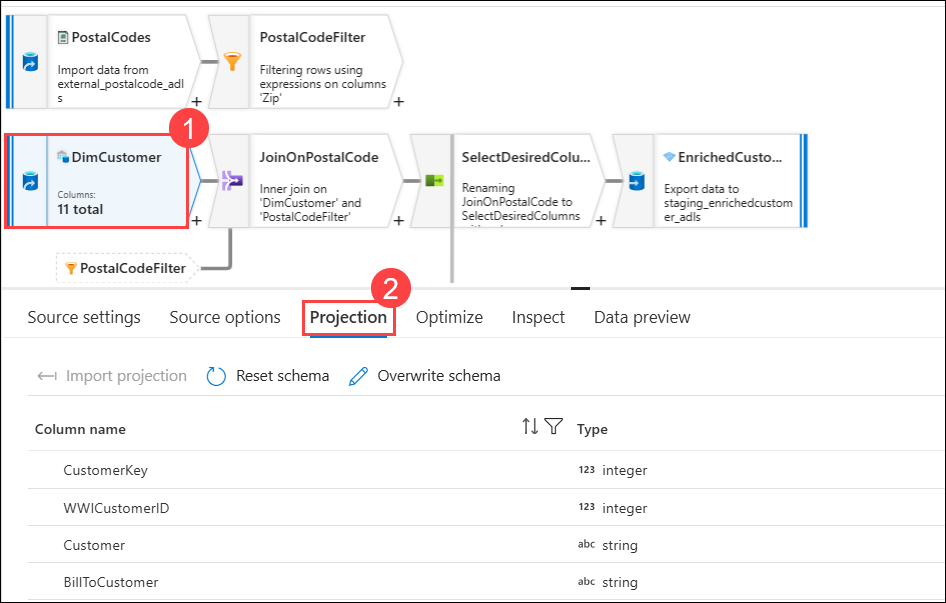

27. Next, select the **JoinOnPostalCode (1)** transformation and ensure the **Join settings (2)** tab is selected to see how you can join datasets using a simple and intuitive graphical interface.

    > The **Join settings** tab allows you to specify the data sources being joined and the join types and conditions. Notice the **Right stream** points to the `PostalCodeFilter` and not the `PostalCodes` data source directly. By referencing the filtered dataset, the join works with a smaller set of postal codes. For extensive datasets, this can provide performance benefits.

    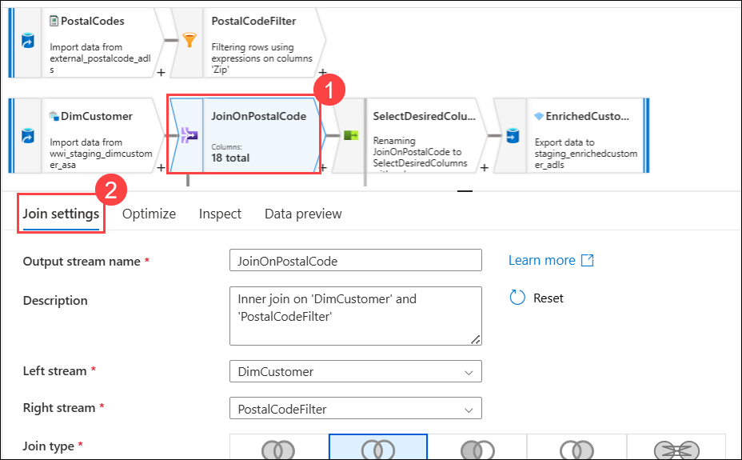

28. Moving on to the next transformation, the **SelectDesiredColumns** transformation uses a **Select** schema modifier to allow choosing what columns to include.

    > You have probably noticed that the `SelectDesiredColumns` transformation appears twice in the graph. To enable writing the resulting dataset to two different sinks, Azure Synapse Analytics and Azure Data Lake Storage Gen2, a **Conditional split** multiple outputs transformation is required. This split is displayed in the graph as a repeat of the split item.

    

29. The last two items in the data flow are the defined sinks. These provide the connection settings necessary to write the transformed data into the desired data sink. Select the **EnrichCustomerData** sink and inspect the settings on the **Sink** tab.

    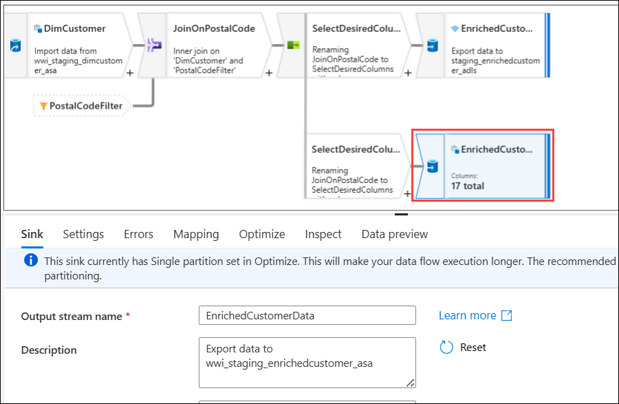

30. Next, select the **Settings** tab and observe the properties set there.

    > The **Settings** tab defines how data is written into the target table in Azure Synapse Analytics. The Update method has been set only to allow inserts, and the table action is set to recreate the table whenever the data flow runs.

    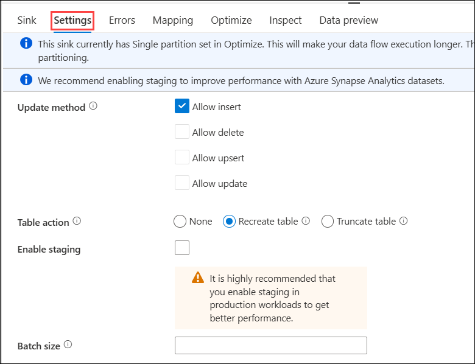

31. Now that you have taken the time to review the data flow, let us return to the pipeline. On the canvas, select the **Exercise 2 - Enrich Data** tab.

    

32. Before running the pipeline there is one more change we need to make. As mentioned above, the data flow depends on the data written by the copy activity, so you will add a dependency between the two activities.

33. In the data flow canvas graph, select the green box on the right-hand side of the `Import Customer dimension` Copy data activity and drag the resulting arrow up onto the `Enrich Customer Data` Data Flow activity.

    

34. This creates a requirement that the **Copy data** activity completes successfully before the **Data Flow** can execute, and enforces our requirement of the Synapse Analytics table being populated before running the data flow.

    

35. The last step before running the pipeline is to publish the changes you have made. Select **Publish all** on the toolbar.

    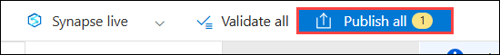

36. On the **Publish all** dialog, select **Publish**.

    > This Publish all dialog allows you to review the changes that will be saved.

37. Within a few seconds, you _may_ receive a notification that the publish completed.

38. Your pipeline is now ready to run. Select **Add trigger (1)** then **Trigger now (2)** on the toolbar for the pipeline.

    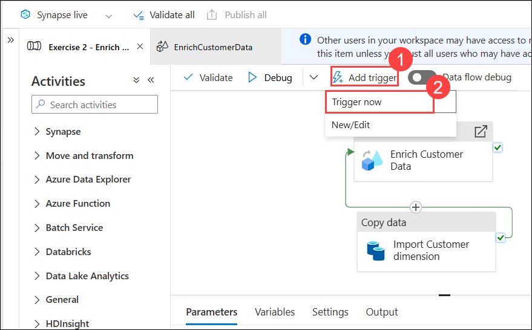

39. Select **OK** on the Pipeline run dialog to start the pipeline run.

    

40. To monitor the pipeline run, move on to the next task.

## Summary 

In this exercise, we explored and modified a Synapse notebook to understand data transformations and analytical steps. We also updated and executed a Synapse pipeline containing a Data Flow to validate end-to-end processing. This provided a hands-on foundation for building and orchestrating data workflows in Synapse.

Now, click on **Next** from the lower right corner to move on to the next tasks.

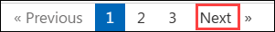
