## Task 3 - Monitor pipelines

After you finish building and debugging your data flow and its associated pipeline, you will want to be able to monitor the execution of the pipeline and all of the activities contained within it, including the Data Flow activity. In this task, you review the [pipeline monitoring functionality in Azure Synapse Analytics](https://docs.microsoft.com/azure/data-factory/concepts-data-flow-monitoring) using the pipeline run you initiated at the end of the previous task.

1. In Synapse Analytics Studio, select **Monitor** from the left-hand menu.

   

2. Under Integration, select **Pipeline runs**.

   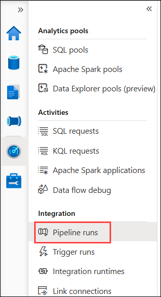

3. Select the `Exercise 2 - Enrich Data` pipeline the list. This will have a status of `In progress`.

   

4. On the pipeline run details screen, you will see a graphical representation of the activities within the pipeline, as well as a list of the individual activity runs. Both provide status indicators for each activity.

   > This view allows you to monitor the overall status of the pipeline run, and observe the status of each activity contained within the pipeline. The screen will auto-refresh for five minutes. If auto-refresh does not occur or your pipeline run takes longer than five minutes, you can get updates by selecting the Refresh button on the canvas toolbar.

   

5. To get a better understanding of the types of information you can get from the monitoring capabilities, let us explore what information is available for each of the activities in the Activity runs list. Start by hovering your mouse cursor over the **Import Customer dimension** activity and select the **Output** icon that appears.

   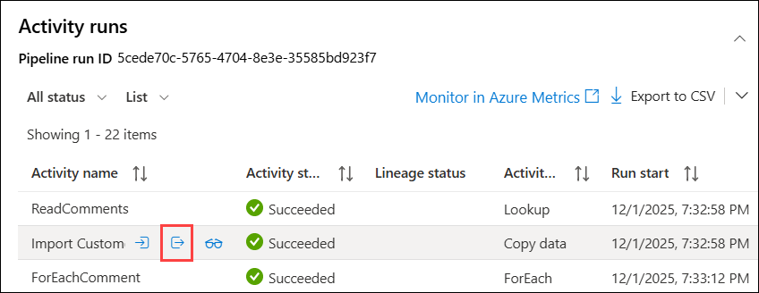

6. In the **Output** dialog, you will see details about the size of data read and written, the number of rows read and copied, the duration of the copy activity, and other information relating to the copy activity run. This information can be used for things like troubleshooting. For example, you could compare the copy run to data, such as the number of rows read and written, to expected numbers from the source and sink.

   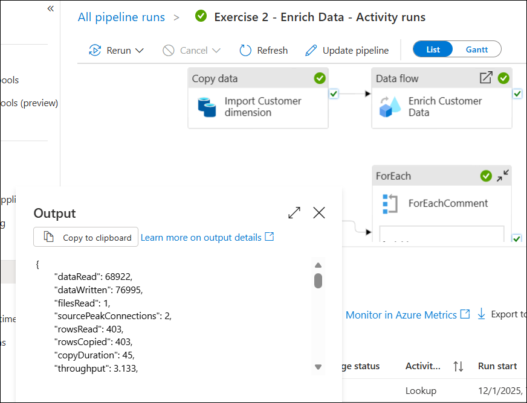

7. Close the Output dialog.

8. Next, hover your mouse cursor over the **Import Customer dimension** activity again, this time selecting the **Details** icon that appears.

   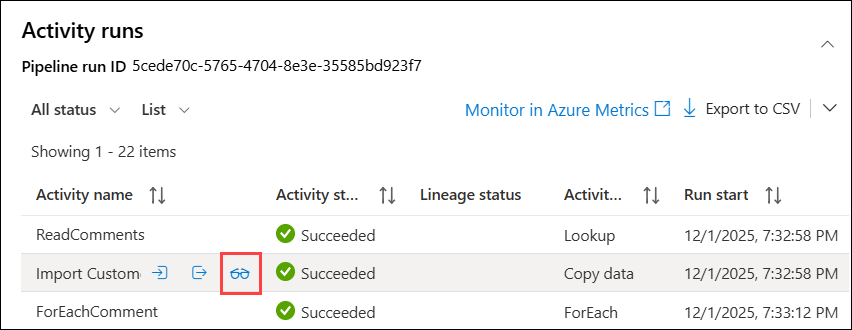

9. The **Details** dialog provides the data found on the Output dialog examine above, but expands on that to include graphics for the source, staging storage, and sink, and a more detailed look at the activity run.

   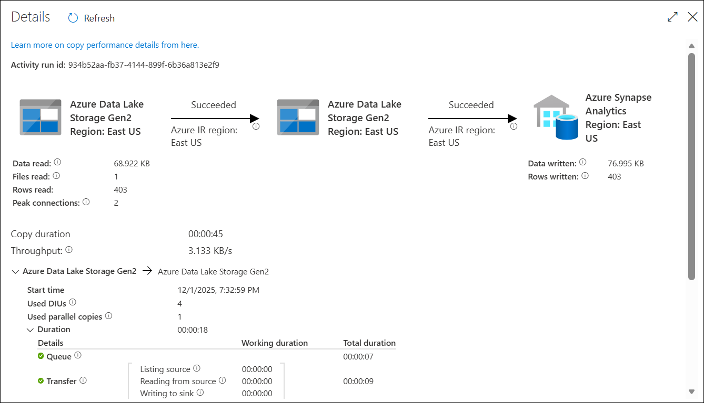

10. Close the Details dialog.

11. When the pipeline execution completes, all activity runs will reflect a status of Succeeded.

    
    
    >It takes around 5 minutes for the pipeline to have a status of Succeeded.

12. When the **Enrich Customer Data** activity has a status of **Complete**, hover your mouse cursor over the **Enrich Customer Data** activity and select the **Details** icon that appears.

    > **Note**: It can take 5-7 minutes for the **Enrich Customer Data** activity to complete. You may need to select **Refresh** on the Monitoring toolbar to see the status update if your pipeline run takes longer than five minutes.

    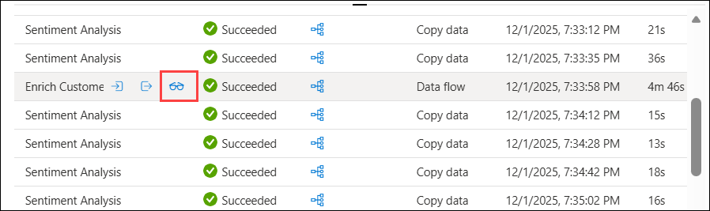

13. The Details dialog for data flow details takes you to a full-screen view of your data flow.

    > The initial view provides a details panel containing statistics for the sinks defined within the data flow. The information for these includes the number of rows written and the processing times for writing to each sink.

    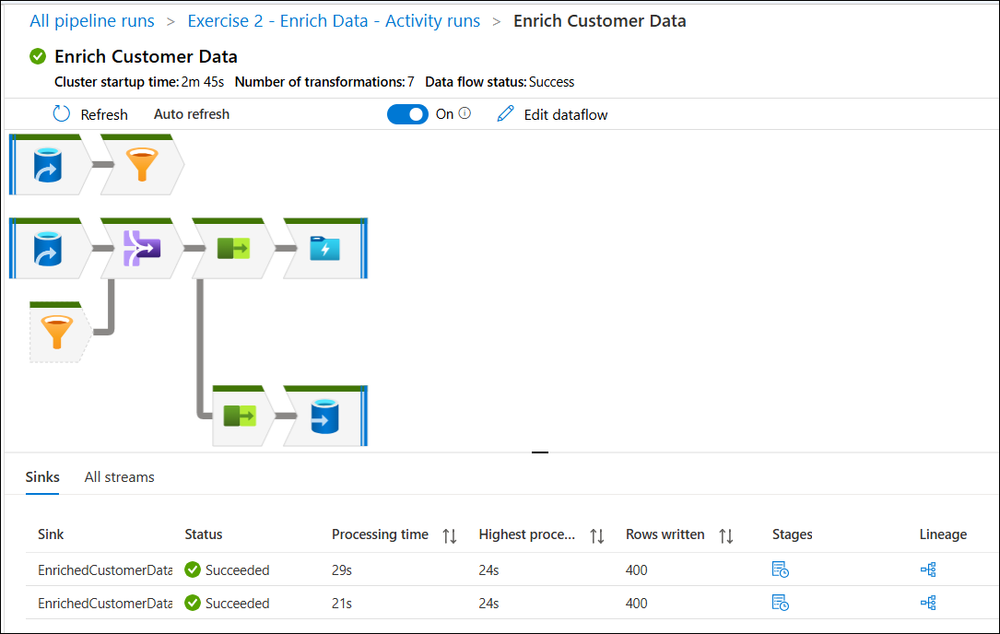

14. Select the **SelectDesiredColumns** transformation step of the data flow.

    > Selecting any component of the data flow opens a new panel with details related to the processing that occurred for that component.

    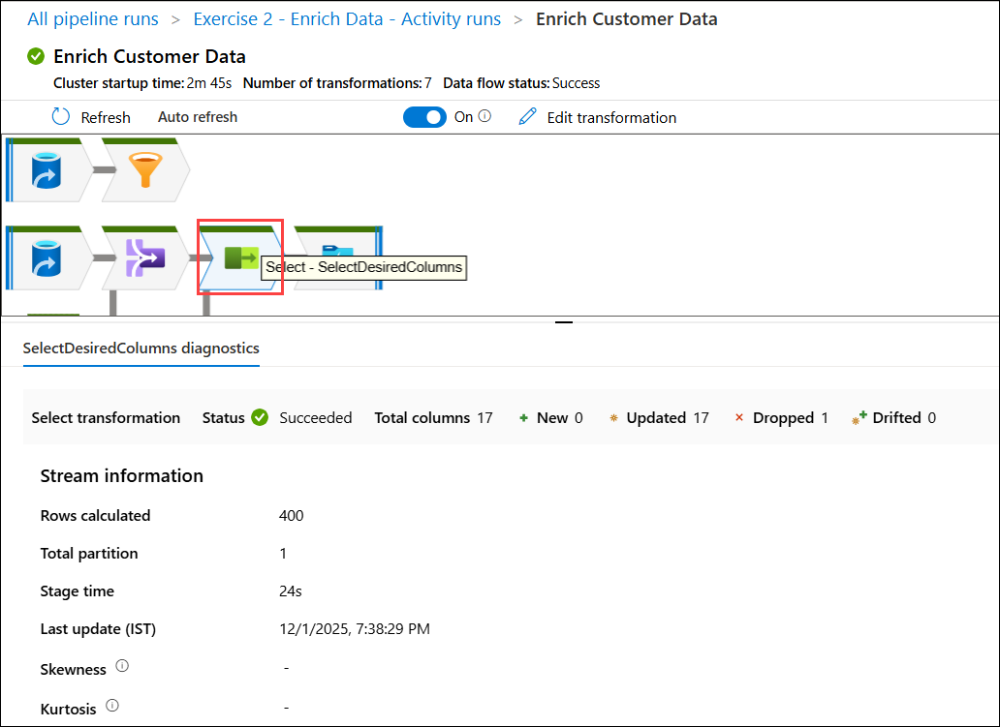

15. Try selecting another component, such as the **EnrichCustomerData** sink, and view the information available.

    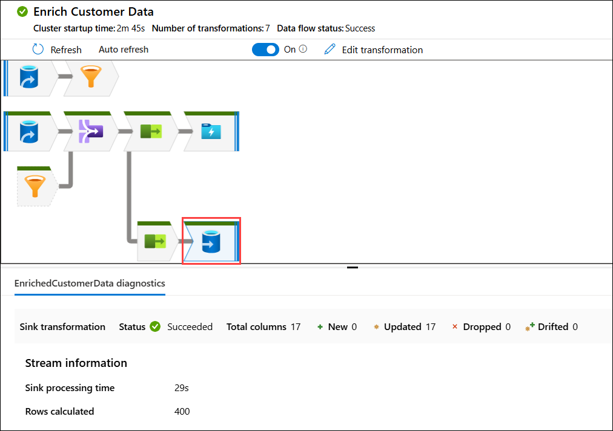

16. Now, navigate back to Exercise 2 - Enrich Data - Activity runs.

    

17. Back on Exercise 2 - Enrich Data pipeline run screen, switch to the **Gantt** view. This view provides a graphical representation of the run times of the various activities within the pipeline.

    

> **Congratulations** on completing the task! Now, it's time to validate it. Here are the steps:
      
   - If you receive a success message, you can proceed to the next task.
   - If not, carefully read the error message and retry the step, following the instructions in the lab guide.
   - If you need any assistance, please contact us at cloudlabs-support@spektrasystems.com. We are available 24/7 to help you out.

<validation step="bee8c9be-ae41-447a-abc8-06578a8aa9d9" />

### Task 3.1: Bonus: Inspect Sentiment Analysis Results

Remember the sentiment analysis task we had in our Exercise 2 - Enrich Data pipeline? Once your pipeline's execution is complete we have some sentiment data we can look into.

1. Go to the **Data ()** Hub, under **Linked (2)** data expand **Azure Data Lake Storage Gen2 (3)**.

    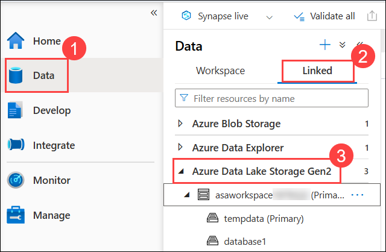

1. Navigate to `dev > bronze > sentiment` **(2)** folder in the primary data lake account **(1)**. Select all the files and right click to select **New SQL script > Select TOP 100 rows (3)**.

   >NOTE: Select all the files except the text file.

   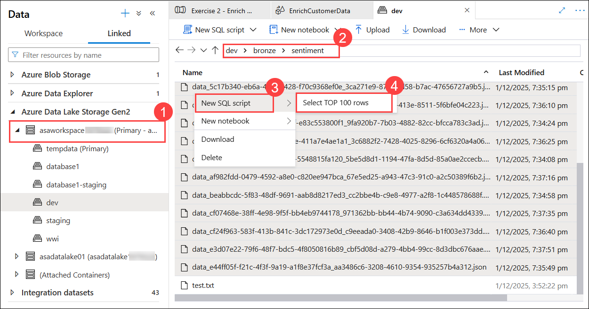

2. Replace the top part of the query **(1)** with the code below. Select **Run (2)** to execute the final query and review the **Results (3)**.

    ```sql
    SELECT 
        jsonContent,
        JSON_VALUE (jsonContent, '$.documents[0].sentiment') AS Sentiment,
        JSON_VALUE (jsonContent, '$.documents[0].id') AS CustomerId
    FROM
    ```

    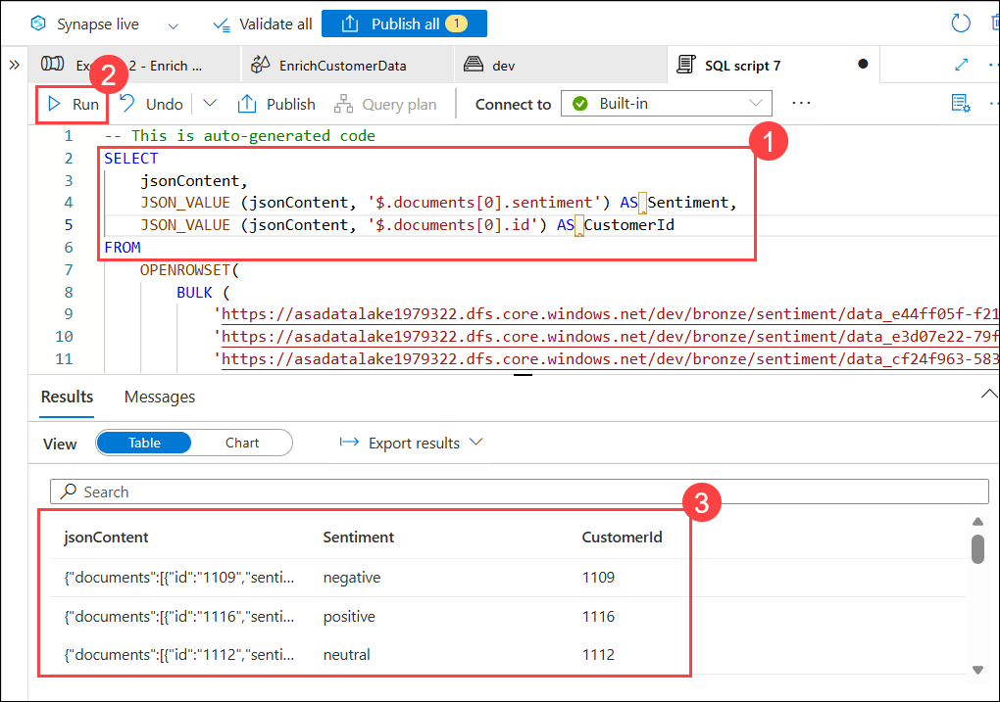

    Your query targets the JSON files created as the result of the Sentiment analysis run through Azure Cognitive Services. Here you see a simple query that shows the list of Customer IDs and how their feedback is interpreted in the context of sentiment reflection.
    
## Task 4 - Monitor Spark applications

In this task, you examine the Apache Spark application monitoring capabilities built into Azure Synapse Analytics. The Spark application monitoring screens provide a view into the logs for the Spark application, including a graphical view of those logs.

1. As you did in the previous task, select **Monitor** from the left-hand menu.

   

2. Next, select **Apache Spark applications** under Activities.

   

3. On the Apache Spark applications page, select the **Local time** value and observe the available options for limiting the time range for Spark applications that are displayed in the list. In this case, you are looking at the current run, so ensure **Last 24 hours** is selected and then select **OK**.

   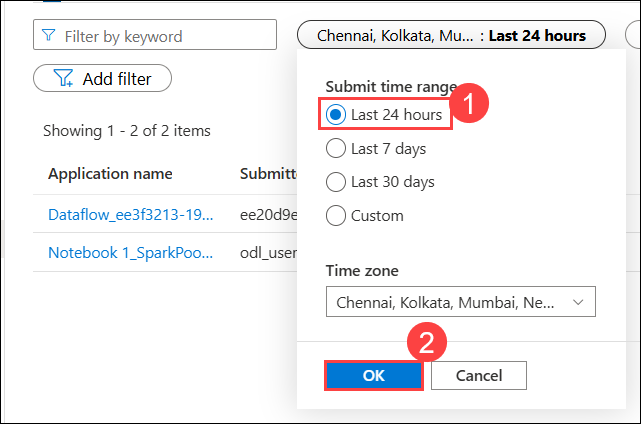

4. From the list of Spark applications, select the first job, which should have a status of `In progress` or `Succeeded`.

   > **Note**: You may see a status of `Cancelled` or `Stopped` , and this does not prevent you from completing the following steps. Azure Synapse Analytics is still in preview, and the status gets set to `Cancelled` or `Stopped` when the Spark pool used to run the Spark application times out.

   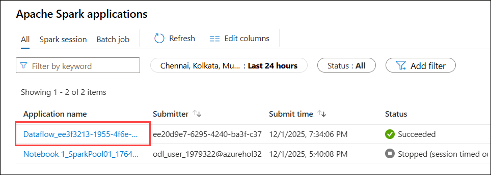

5. On the **Dataflow** screen, you will see a detailed view of the job, broken into three different sections.

   - The first section is a graphical representation of the stages that make up the Spark application.
   - The second section is a summary of the Spark application.
   - The third section displays the diagnostics and logs associated with the Spark application.

     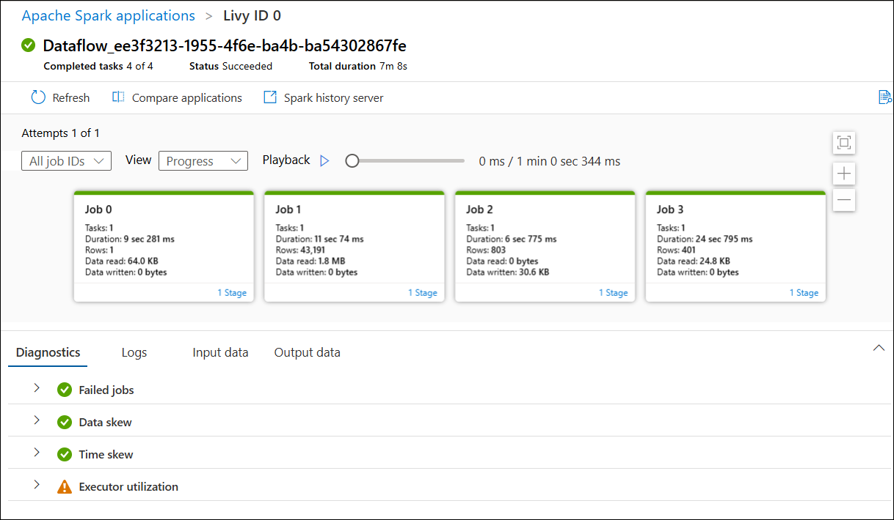

6. Select the **Logs** tab to view the log output. You may switch between log sources and types, using the dropdown lists below.

   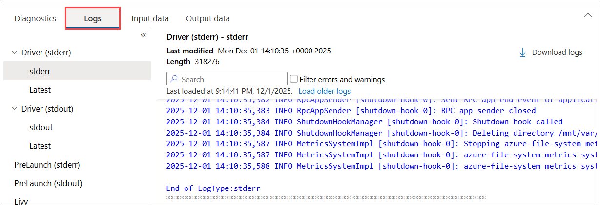
   
7. To look closer at any individual job, you can use the **Job IDs** drop-down to select the job number.

   

8. This view isolates the specific job within the graphical view.

   

9. Return the view to all jobs by selecting **All job IDs** in the job ID drop-down list.

    

10. Within the graph section, you also have the ability to **Playback** the Spark application.

    

    > **Note**: Playback functionality is not available until the job status changes out of the `In progress` status. The job's status will remain listed as `In progress` until the underlying Spark resources are cleaned up by Azure Synapse Analytics, which can take some time.

11. Running a Playback allows you to observe the time required to complete each job, as well as review the rows read or written as the job progresses.

    

12. You can also perform playback on an individual job. Returning to a view of only Job 2 **(1)**, the **Playback (2)** button shows the rows written at this job, and the progress of reads and writes.

    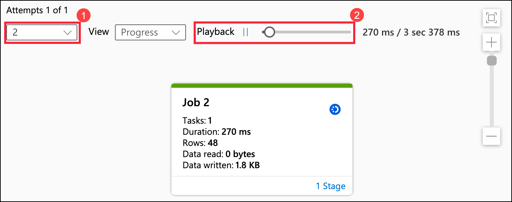

13. You can also change the view to see which jobs involved read and write activities. Select **All job IDs (1)** in the job dropdown, and in the **View** drop-down, select **Read (2)**. You can see which jobs performed reads, with each color-coded by how much data was read.

    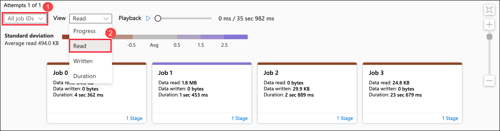

## Summary

In this lab, you used **Azure Synapse Analytics** to build a **modern data warehouse** by ingesting, transforming, and monitoring data. You explored **Synapse Notebooks** to process and transform data, modified and executed a **Pipeline with a Data Flow** for ETL operations, and monitored **pipelines and Spark applications** to optimize performance and troubleshoot execution issues.

## You have successfully completed the lab.